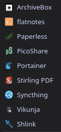

2024 is slowly shifting to dawn, it is soon time to kiss it goodbye and welcome 2025 with our arms wide open.

For me personally, 2024 has been one of the most impactful year ever. I'll describe a little bit about it here.

I'll start this new "series" of post for each year ending. This is very much inspired of [Frank Ruan](https://frank-ruan.com/)'s blog page, but I find the exercise of putting back your experience over the year very interesting.
This will help remember the actions I have taken over the year, and let others see my accomplishment and what I've gone through.

## Technology

### Personal setup

#### Stuff I bought

This year, I have bought quite a few significant stuff that I will daily drive:

- Watch: [OnePlus Watch 2R](https://www.oneplus.com/us/oneplus-watch-2r)

  An amazing watch that last 3-4 days after its last full charge. This carefully engineered watch provides many features I enjoy having, without fearing to shutdown every days.

- Headphones (At home): [Sennheiser HD600](https://www.sennheiser-hearing.com/en-US/p/hd-600/) + Headphones (Nomad): [Sennheiser Momentum 4](https://www.sennheiser-hearing.com/en-US/p/momentum-4-wireless-pride-edition/)

  I've talked about these in my [about](/about/) page. I have moved from my old [SteelSeries Arctis 5](https://steelseries.com/gaming-headsets/arctis-5) headset. Moving to an audiophile headphones was the smartest thing to do. I have been recommended the HD600 by an artist. Thank you!
  The Momentum 4 is more of a personal choice. I moved away from truly wireless earphones. This was also a smart idea, though, it took quite some time to adapt myself to the audio quality of the Momentum 4, which is more "Pretty alright", compared to the "Amazing experience" of the HD600.

- e-ink tablet: [Boox Note Air 4C](https://ewritable.net/brands/boox/tablets/boox-note-air4-c/)

  I have moved away from my [reMarkable 2](https://remarkable.com/), which has electronics issues. I can't use it anymore, so I decided to move away from the reMarkable brand, which is way too restrictive for me. It was good! But I am wishing that Boox will offer me more freedom on my usages.

- Miscellaneous: [AVERY Zweckform L4731REV-65](https://www.amazon.com/-/en/dp/B0D1QRS91Z)

  Bear with me, this isn't a joke. Since I have started using [Paperless-ngx](https://docs.paperless-ngx.com/), I needed to "tag" my physical files. I am using an "ASN" system (Archive Serial Number). I advise you to look at [The recommended workflow](https://docs.paperless-ngx.com/usage/#usage-recommended-workflow) of Paperless-ngx to understand how I am doing my archiving today.
  As such, I am using these sheets of paper with Tobias L. Maier's [QR Code Label Generator](https://tobiasmaier.info/asn-qr-code-label-generator/) website to create ASN tag I just have to paste on my archives. An amazing gain of time and productivity.

#### The selection of OS

I have slowly shifted to using Linux as my main OS on my computers (Both laptop and desktop). It's been a smooth ride with Fedora.

I still dual boot with Windows 11 on my desktop for gaming. Certain games doesn't run well on Linux, and I'll probably just entirely stop gaming on Linux until I no longer use Windows.
Sharing a Steam storage between Linux and Windows is more trouble than anything.

Also, for Windows, I used to run with [Atlas OS](https://atlasos.net/). While I appreciate the modification realized to Windows and the increase of privacy, the modification it provides are cause more troubles than help.
I would rather now, use a tool such a [Win11Debloat](https://github.com/Raphire/Win11Debloat) to modify Windows to my needs.

#### Using "dotfiles" tooling

I started using [chezmoi](https://chezmoi.io/) to manage certain files I wish to share between my machines. It has been an absolute immense gain of time for my productivity.

The ability to share my shell configuration over my machines, my installed packages on my system, declaratively installed, is such an amazing feature for me.
I have looked at others tools, other than chezmoi. The advantages of chezmoi over others tools are interesting, but I don't like that you have to make up everything yourself, which can take a lot of time.
Thankfully, many others persons have already did things with chezmoi, so you can learn from them.

Check out my dotfiles repository to know more about my dotfiles collection: <https://github.com/Sutaai/dotfiles>

#### Switching to the fish shell

Last, and additionally, I have switched over from [zsh](https://www.zsh.org/) + [Oh My zsh](https://ohmyz.sh/) to [fish](https://fishshell.com/) + [Oh My Fish](https://github.com/oh-my-fish/oh-my-fish).

It's been a HUGE productivity enhancement to me. fish is MUCH, **MUCH** more friendly in its syntax and scripting. I have made in minutes what would have probably have taken in hours with zsh/bash.

This is literally one example I have:

```fish
# Add a directory to the shell's PATH
fish_add_path $HOME/.local/bin
```

...compared to zsh/bash:

```bash
# Add a directory to the shell's PATH
export PATH="$PATH:$HOME/.local/bin"
```

Be realistic. Which syntax is the most user-friendly?
This alone, is enough for me to adopt fish.

But not only that, there are many others features out of the box, like colors syntax highlighting, and completions based on history. Very nice!
It's just... out of the box, and that is all I truly need. Having to use plugins with zsh for such functionalities annoys me very much. Most especially when some [appears dead](https://github.com/zsh-users/zsh-syntax-highlighting/commits/master/).

### Server setup

I have recently decided to rent a dedicated for a quite low price of 40€/month. While this appears expensive at first, the server is amazingly powerful.
I am currently hosting over 11 services on one single server. Namely:

- [Paperless-ngx](https://docs.paperless-ngx.com/), to archive my files. One of the most impactful I have started using.
- [Vikunja](https://vikunja.io/), an open-source Trello alternative that help me organize my life and work.
- [ArchiveBox](https://archivebox.io/), to take snapshots of websites that might disappear one day.
- [PicoShare](https://github.com/mtlynch/picoshare), my solution to share files to other persons. Sharing a link is better than solutions like [Pairdrop](https://github.com/schlagmichdoch/pairdrop) in certain, if not most scenarios.

Here's the (almost!) full list of the stuff I host:


I have yet to build my own, personal home server. This is a wish I have, I do not want to keep this server forever, I want to switch over full local soon.
Hence, I am using an external storage solution for whenever I'll switch from this server to my own. Something I don't like to do, sadly, but... eh, better than fully stored on the server.

I highly recommend you to take a look at [awesome-selfhosted](https://awesome-selfhosted.net/) to check out more stuff you could wish to use/host yourself.

## Studies

Things have been heavily stressful for the beginning of the second year of networking and apprenticeship.
It has been extensively filled with intense work, very short time frame to realize projects, and extremely complex subjects.

And I really don't like maths, honestly. Which is a lot of our studies. oochie :(

I basically have two periods, periods at school, and periods at work.
It feels weird, because it feels like school is absolutely crushing over work time. I feel like I'll never have enough time to complete what I must complete for school, which, well, is very required to complete to finish my year.

This crushing feeling of school feels unbearable. Thankfully, it's only for 2 years for now on.

## Work

I have started working since mid-October. My first work experience as a sys. and networking administrator.
I've learned a ton of new things. Funny enough, I feel like only VLAN was something worth to learn in my last year of school.

I am currently working for a city in France. So we have a really robust and developed environment.
I also have learnt very valuable new knowledge too. Understanding a true production environment, tools that are used to manage our sites, etc.
Something I truly appreciate in this specific environment.

I probably will talk more about my experience and what I've learned there. There are plenty of things I wish to talk about! (Namely, how my enterprise can absolutely read everything from our users)

## Trans experience

This is a more sensitive topic. Feel free to stop reading from here. I will talk about me personally here.

This year has been particularly impactful toward my identity. It is the year I have finally decided to no longer be questioning myself, and just be who I always wished to be. That is, to be transgender. To turn from male to female.
I had enough to put myself in questions again and again, and experience dysphoria.

I have taken this final decision in late August. It has been since 4 months since I started being more feminine in my daily life, and it's been 1 month since I have started [HRT](https://en.wikipedia.org/wiki/Hormone_replacement_therapy)/[GAHT](https://en.wikipedia.org/wiki/Gender-affirming_hormone_therapy).
It has been a huge change for me since I have started HRT. Many things are already starting to change in me, and there's yet other changes to experience. I may or may not talk about it.

I have made my coming out to my friends; very few have decided to leave me behind since then, but most of them are just fine about it.

I have made my coming out to my parents too; they are supporting my decision. This won't be the case with most of my family members, but my parents are the only most importants persons I had the wish that they support me.

All of this aside, this is, hopefully, the last year where I will have to spend Christmas the way I used to be before. Next year, I hope to be on my feminine side. This will be a shock, for sure. But I expect to be feminine looking by a year.

## Conclusion

2024 was a rough year. It's been full of happy experience and sad moments too. But overall, this is also the most amazing year I've ever had, and the most revealing too.
I can't wait to see what next years will have to show me.

An amazing year not only on a personal aspect, but also for all the knowledge I have gathered and the new toys I own now.

Until next time.
