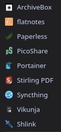

2024 is slowly shifting to dawn, it is soon time to kiss it goodbye and welcome 2025 with our arms wide open.

For me personally, 2024 has been one of the most impactful year ever. I'll describe a little bit about it here.

I'll start this new "series" of post for each year ending. This is very much inspired of [Frank Ruan](https://frank-ruan.com/)'s blog page, but I find the exercise of putting back your experience over the year very interesting.
This will help remember the actions I have taken over the year, and let others see my accomplishment and what I've gone through.

## Technology

### Personal setup

#### The selection of OS

I have slowly shifted to using Linux as my main OS on my computers (Both portable, and my tower). It's been a smooth tide with Fedora.
I still dual boot with Windows 11 on my tower for gaming. Certain games doesn't run well on Linux, and I'll probably just entirely stop gaming on Linux until I no longer use Windows.
Sharing a Steam storage between Linux and Windows is more trouble than anything.

Also, for Windows, I used to run with [Atlas OS](https://atlasos.net/). While I appreciate the modification realized to Windows and the increase of privacy, the modification it provides are cause more troubles than help.
I would rather now, use a tool such a [Win11Debloat](https://github.com/Raphire/Win11Debloat) to modify Windows to my needs.

#### Using dotfiles

I started using [chezmoi](https://chezmoi.io/) to manage certain files I wish to share between my machines. It has been an absolute immense gain of time for my productivity.

The ability to share my shell configuration over my machines, my installed packages on my system, declaratively installed, is such an amazing feature for me.
I have looked at others tools, other than chezmoi. The advantages of chezmoi over others tools are interesting, but I don't like that you have to make up everything yourself, which can take a lot of time.
Thankfully, many others persons have already did things with chezmoi, so you can learn from them.

Check out my dotfiles repository to know more about my dotfiles collection: <https://github.com/Sutaai/dotfiles>

#### Switching to fish

Last, and additionally, I have switched over from [zsh](https://www.zsh.org/) + [Oh My zsh](https://ohmyz.sh/) to [fish](https://fishshell.com/) + [Oh My Fish](https://github.com/oh-my-fish/oh-my-fish).

It's been a HUGE productivity enhancement to me. fish is MUCH, **MUCH** more friendly in its syntax and scripting. I have made in minutes what would have probably have taken in hours with zsh/bash.

This is literally one example I have:

```fish
# Add a directory to the shell's PATH
fish_add_path $HOME/.local/bin
```

...compared to zsh/bash:

```bash
export PATH="$PATH:$HOME/.local/bin"
```

Be realistic. Which syntax is the most user-friendly?
This alone, is enough for me to adopt fish.

But not only that, but I also really, really like that fish, out of the box, provide colors syntax highlighting, and completions. Very nice!
It's just... out of the box, and that is all I truly need. Having to use plugins with zsh for such functionalities annoys me very much. Most especially when some [appears dead](https://github.com/zsh-users/zsh-syntax-highlighting/commits/master/).

### Server setup

I have recently decided to rent a dedicated for a very low price of 40€/month. While this appears expensive at first, the server is extremely powerful.
I am hosting over 11 services on one single server. Namely:

- Paperless-ngx, to archive my files. One of the most impactful I have started using.
- Vikunja, an open-source Trello alternative that help me organize my life and work.
- ArchiveBox, to take snapshots of websites that might disappear one day.
- PicoShare, my own solution to share files to other persons. Sharing a link is better than solutions like [Pairdrop](https://github.com/schlagmichdoch/pairdrop) in certain, if not most scenarios.

Here's the full list of the stuff I host:


I have yet to build my own, personal home server. This is a wish I have, I do not want to keep this server forever, I want to switch over full local soon.
Hence, I am using an external storage solution for whenever I'll switch from this server to my own. Something I don't like to do, sadly, but... eh, better than fully stored on the server.

I highly recommend you to take a look at [awesome-selfhosted](https://awesome-selfhosted.net/) to check out more stuff you could wish to use/host yourself.

## Studies

Things have been heavily stressful for the beginning of the second year of networking and apprenticeship.
It has been extensively filled with intense work, very short time frame to realize projects, and extremely complexe subjects.

And I really don't like maths, honestly. oochie :(

I basically have two periods, periods at school, and periods at work.
It feels weird, because it feels like school is absolutely crushing over work time. I feel like I'll never have enough time to complete what I must complete for school, which, well, is very required to complete to finish my year.

## Work

I have started working since mid-October. My first work experience as a sys. and networking administrator.
I've learned a ton of new things. Funny enough, I feel like only VLAN was something worth to learn in my last year of school.

I am currently working for a city in France. So we have a really robust and developed environment.
I also have learnt invaluable new knowledge too. Understanding a true production environment, tools that are used to manage our sites, etc.
Something I truly appreciate in this specific environment.

I probably will talk more about my experience and what I've learned there. There are plenty of things I wish to talk about! (Namely, how my enterprise can absolutely read everything from our users)

## Trans experience

This year has been the year of big reveals, not only for me, too.
