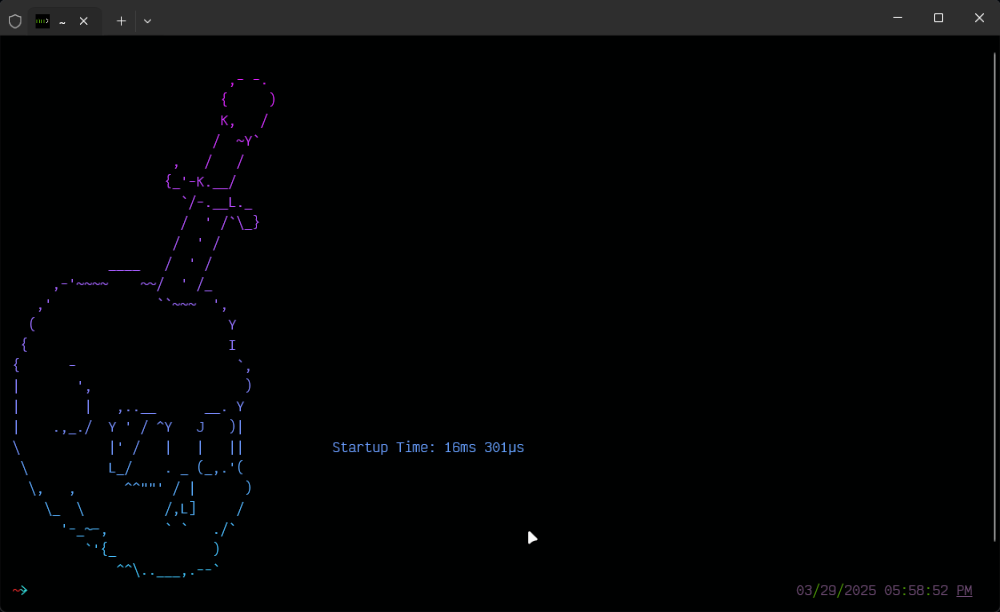
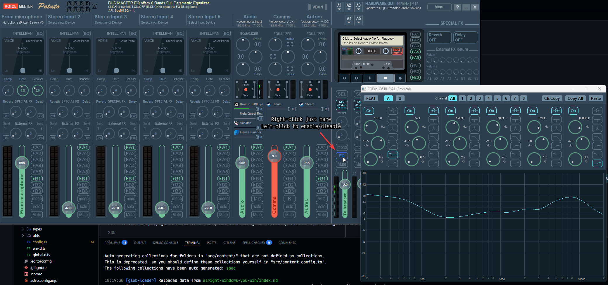

*Image Credit: [y75zei](https://x.com/Y75Zei) - <https://danbooru.donmai.us/posts/9063648>*

I am a defender of open-source projects. Sadly, it isn't everyone's philosophy. Bummer. And, well, whatever.

One thing we are daily driving is our computer; and its operating system. And so, three paths opens to you:

- Will you use the most popular operating system, the most user-friendly (so to say), most recognized, and the one you're the most likely to be the most experienced with? But, don't forget your [entry ticket](<https://www.microsoft.com/en-us/d/windows-11-pro/dg7gmgf0d8h4>)!
- Have you paid the Apple tax? If so, welcome to your new [privacy-invading](<https://inteltechniques.com/book7.html>) home. (There's a lot you should read in that book)
- Do you feel adventurous, traveler? Do you wish to explore Linux, and its open world? The greatest place of freedom known to technology, but will you dare challenge its step learning curve? But fear not, it's all free for you to explore this wonderful landscape.

Okay, you actually only have *two paths*, assuming you haven't paid the Apple tax. And if you have, you're unlikely to use any other OS anyway.
And obviously, almost everyone uses Windows these days.

And I've been there too. I've used Windows as my daily drive too. It has been a fair ride, with struggles at time, most especially for programming. It quickly become easy to understand that programming on Linux is only a fair (and sometime sane) decision.

So I've decided to run Linux for some times.

## My experience with Linux

To reiterate, I have two computers:

1. My "main" computer, a desktop, with a quite solid configuration.
2. My secondary computer, a laptop, with trembling performances and a doubtful price tag. (it wasn't cheap, the b*tch.)

### How it began

Back when I switched to Linux, I began it all with my laptop. I wiped Windows from the drive, and replaced it with [Fedora 39](https://fedoraproject.org/). I started with the GNOME windows manager.

The experience was pleasant, everything felt smooth, I had experience with Linux, I know how to deal with a terminal, to mess and toy around with stuff and enjoy a quite joyful experience.
This is quite how GNOME feel in a single word: joyful. It's simple, easy, straight up clean.

But in my personal opinion, it is missing tools, options, tweaks, you would be used to on a MacOS or Windows... And being "dependant" of user-maintained plugins quite irritate me a little. It show how lacking can it be.

And so I tried **KDE**. Luckily for me (Or fearfully), KDE version 6 released quite recently after I decide to make the switch.
While the refreshed desktop experience really made its charm, it also came with a few bugs that got patched a few weeks/months later, so I didn't mind it too much. I understand it can't be perfect.

And that's as far as how I've configured my Linux environment. KDE for it all. It was quite good, but... KDE also come with its quirks.
While KDE came with plentiful of tools, options/settings, tiny details and way more full of features (That's, again, in **my opinion**), there's probably TOO MUCH of them! Some feels like they've been unmaintained for years, and glitches are quite common in KDE.

Additionally, while less required than GNOME, tons of aspect of KDE can be customized using... user-submitted content. And those "plugins" are way, *WAY* less maintained than the KDE ones.
So maybe I should have stayed the GNOME way. Go figure.

#### Breakage

Now, as I said, I was using Fedora 39 up to 41. What it pretty much want to sum up as is: "Be a good OS for a computer that is loved for general purposes users".
And so, to ensure quality, packages are generally manually reviewed by Fedora's contributors, to avoid huge breakages.

So here's the pretty much what made me seal the nail of the coffin of leaving it behind.

- A kernel update of Linux made my laptop flash and stay stuck on a black screen after waking up from sleep, forcing to reboot the laptop. Which is a HUGE bummer for a laptop. It stayed so for ~1 month.
- A KDE update made the taskbar absolutely unusable. It stayed so ~2 months.
- Dual booting for gaming is... Not fun. Steam will update OS specific games/library every time you boot on a different OS since last time, quite beating the purpose of dual booting.
- I play a few very specific games, which will never run on Linux, for example DCS.
- Updates are sometime really slow and annoying. While I do appreciate the up to date distro, it's a way more violent schedule than Windows (Almost... every two days?). So, Windows users, stop complaining. Seriously. :p

And so, since I was quite unamused for these different points, most especially focused on gaming, it's about time to just... use Windows for a gaming computer!

All hail this damn OS!

#### Something that left a bitter taste with my current dual boot Windows at the time

So I wanted to switch to Windows. Sure, why not. So my goal was to **clear entirely the drives, and install a new Windows**. Destructive? Indeed!
I could have just deleted Linux (Which used 100Go, when I gave it a partition of... 400Go iirc), and claimed back the free space for the Windows partition.

The thing was that I was using a "customized" Windows, using a modification called "[AtlasOS](<https://atlasos.net/>)".

As I mentioned in my [2024 review](<2024-in-review/index.md>):

> [...] While I appreciate the modification realized to Windows and the increase of privacy, the modification it provides are causing more troubles than help.

AtlasOS has this bad habit to apparently entirely cut off Windows Update. Not the very basics one such as Microsoft Defender antivirus database (thank god!), or to oil up the current version of Windows. But anything about *upgrading* was out of the question apparently.
And yes, that is to me, an issue. What if I want to mess with the brand new [Copilot](<https://support.microsoft.com/en-us/windows/welcome-to-copilot-on-windows-675708af-8c16-4675-afeb-85a5a476ccb0>)? (eww)
<!-- Lol, I can't wait for that URL to die! -->

And secondly. Whenever the AtlasOS team went out to release an AtlasOS update (So pretty much their scripts to "tweak" Windows), it would generally require **a whole OS reinstall**!

And that, my friends, is an absolute ***no***. Upgrading shouldn't impact user's documents/experience.

So throw me this out the Windows! We'll just use tools to tweak Windows yourself!

## Going back Windows style

Alright folks. Let's grab a new ISO and reinstall Windows...

### Prepping an ISO or go raw?

I've regularly seen in the recent months a certain occurrence of peoples that "clean" an ISO file of Windows before putting it in the computer.
I'm not really entirely sure if I'm fond of such solutions. I've personally decided to alter the OS only once it's installed.
I don't mind if the PC send a few telemetry right after being installed, as long as I disable them later down the line.

### During the installation

During the installation, Windows will be *sneakily* be installing applications you do not wish for after installing the OS.
This is a feature called OOBE (Meaning "Out Of the Box Experience"). From the Windows website, this features describe the following:

> When customers turn on their Windows 11 PCs for the first time, they'll see the Windows Out of Box Experience (OOBE).
> OOBE is a series of screens that require customers to accept license agreements, connect to the internet, log in with, or sign up for a Microsoft Account (MSA), and share information with the OEM.
> The choices you make in your hardware and software determine how much work customers must do to complete OOBE before they can enjoy their new devices.

Also by default in Windows ISO, you're **forced** to register with a Microsoft account to create your profile.

I do not want this, I want to use a **local** account, one that only stays on this computer and not into some cloud bullshit thingies. I don't even understand why the need of a Microsoft account for a PC.

One way to disregard these two problems:

1. Disconnect your PC from Internet (Unplug Ethernet, disconnect from Wi-Fi)
2. Get to the page to connect to Internet, and click on `Shift`+`F10`. This will open a command prompt window.
3. Enter `OOBE\BYPASSNRO`. Your computer will reboot. Do not reconnect to Internet yet.

Congratulations! You've bypassed OOBE. Now go through normal setup, **BUT**, when requested to connect to Internet, select "I don't have internet".
This will create a local account on your machine.

Once you've completed the initial setup, you're welcomed into your new session.

### Clean the windows

🤡 i know, i make such amazing joke.

Anyhow, once in the new session, I would like to use a tool called [winutil](<https://github.com/ChrisTitusTech/winutil>), to clean up Windows and do some house keeping.

You're advised to check out the repository's README to know how to launch the program.

Once there, you can enable/disable certain tweaks to better customize Windows to your liking:

Feel free to chose the tweaks you'd like to use.

Also, this program is very nice! There's a button to launch [O&O ShutUp 10++](<https://www.oo-software.com/en/shutup10>) super easily, which allows you to set up some more additional tweaks, **BUT THAT MAY INTERFERE WITH YOUR EXPERIENCE**.
So please be careful with this one.

### Using a package manager

Here's my N°1 hate about Windows philosophy. There is no package manager. If a program must be updated in an "user-convenient" way, it has to be programmed into the application.

In the recent years, Microsoft has came with [WinGet](<https://github.com/microsoft/winget-cli>) to try reverting this philosophy.
At first, I wasn't very attracted by this tool, but it appears to be the way to go nowadays, compared to [choco](<https://chocolatey.org/>) or [scoop](<https://scoop.sh/>).

I also very dislike how choco is being more and more hungry for money and keep adding "ads" (So to say) in its CLI tool.
And scoop has issues I don't appreciate, and appears to have the least up to date packages.

Meanwhile, WinGet seems to have up to date packages, has most of the tools I use (Generally, if it's not on WinGet, it's on scoop), and well, it's integrated into the system nowadays.

To all this great mix, I use [UniGetUI](<https://github.com/marticliment/UnigetUI>) to search, download, manage my packages.
It's a very, very great program, does the job amazingly, support many packages manager, well updated... The go to way for a user-friendly experience!

#### What are some packages I recommend?

I love telling about what I use, so here's a few personal recommendations:

- Auto Dark Mode - It's in the name! :) will switch Windows to light/dark mode depending of the time
- avidemux - For quick video cropping/re-encoding
- Bulk Crap Manager - Helps you remove programs more efficiently
- File Converter - Can convert file locally,easily, right into the explorer
- Flow Launcher - I thought `Alt`+`Space` was kinda over hyped, but it's actually amazing, and much better than searching in the Windows start menu imo.
- Handbrake - Video re-encoding, basically
- Kdenlive - For editing videos
- Krita - For drawings
- NAPS2 - For scanning documents. Provide the basics editing tool, and is quite efficient and professional.
- OnlyOffice - The go-to way for office documents. (Most especially to not lose compatibility with Words/Excel/whatever)
- Open-Shell - An improvement to the default start menu.
- Photo Demon - Basic photo editing. I'm still trying to learn about it, but it's overall efficient, tho it appears a bit... clingy.
- Rancher Desktop - An open-source alternative to Docker Desktop.
- Remote Desktop Manager - To store remote sessions in a single place. Can almost do anything, SSH/VNC/RDP/Web, etc.
- SageThumbs - Better previews in the Explorer.
- Screenbox - Beautiful looking videos/music thank to VLC backend.
- SumatraPDF - Extremely efficient PDF viewer.
- tlrc - The Rust rewrite of the [tldr](<https://github.com/tldr-pages/tldr>)'s CLI tool.
- Warp - Terminal emulator. Modern and good looking, also bake AI into it.
- WizTree - Just so you know where your junk is from in your system.
- Zen Browser - Finally, the browser of my choice. I've seen this browser grow up. It is now, imo, very stable, and can be used efficiently.

### The shell experience

Okkkaay, now that's a more touchy part of this post, and also the reason why I made this post too.

While I'm not a developer, I still use the terminal daily/regularly. For me, a good experience IS necessary.
And obviously, Linux is the BEST experience between the two OS I've talked about.
But we obviously can't install [bash](<https://www.gnu.org/software/bash/>), [fish](<https://fishshell.com/>), or [zsh](<https://www.zsh.org/>) in Windows. Unless you use [WSL](<https://learn.microsoft.com/en-us/windows/wsl/>), but I don't want to use WSL, obviously.

I'm also not a big fan of [PowerShell](<https://learn.microsoft.com/en-us/powershell/scripting/overview>) (Though I started to like it more and more recently), and I wished for a more "UNIX-style" experience.
I really dislike the "Windows-like" case styling. It ALWAYS feels too verbose.
While you can do `ls` on PowerShell, the actual, correct term is `Get-ChildItem`.

#### HOWEVER

I heard of a brand new shell that came out of town quite recently. It's called [Nushell](<https://www.nushell.sh/>), and it has quite the mix of both world.

It comes with the object-based experience of PowerShell, while keeping this UNIX-feeling.
It also holds SO MUCH great commands available by default. Just, for example, the [HTTP client](<https://www.nushell.sh/cookbook/http.html#http>). It works so well!

Feel free to read [Nushell's cookbook](<https://www.nushell.sh/cookbook/>) to see by yourself some common examples of what can Nu do.

AND, to make it all amazing, it is written in Rust! Which makes the shell blazingly fast.
See by yourself my personal startup time:

I feel like I'm using fish on Windows, but structured. It just feels good.

I am also mixing Nushell with [Carapace](<https://github.com/carapace-sh/carapace-bin>), which helps me obtain command completion for almost anything I am using (For example, git or yt-dlp).
You can also add Carapace to many others shell, like PowerShell, so it gets available to both, in case you need to use it.

### A comment on equalizer

For those who knows me a bit better, it is very important for me to care for my audio experience.
As such, I'm using an equalizer.

↓↓↓ *Audiophiles*

For those who are starting to boil by this simple fact, please go watch [this](<https://youtu.be/PsijHAVLbuY?si=1IrGprB67SFjcAWP>) :)

Now, I personally use [VoiceMeeter Potato](https://vb-audio.com/Voicemeeter/potato.htm) by VB-Audio, and it does an AMAZING job, not only at EQ-ing, but also improving a few other things I'll mention.

As I use the Sennheiser HD600, I use [AutoEq](https://autoeq.app/) to get the "auto-corrected" equalized settings for my headphones. All I need is to drop it into VoiceMeeter and enable the EQ.

You might have also noticed that I use "Mix down A" in the channel of my headset output. This is basically to turn surround sound into stereo (As, it's a headset, it only has two drivers!). This is a feature called [Virtual surround](https://en.wikipedia.org/wiki/Virtual_surround).

Also, you might notice two Voicemeeter input channel (I don't use the third), "Audio" and "Comms". Vesktop is being misleading, but I use "Comms" to increase the volume of communication in voice communication compared to my normal audio.
Helps regulate the difference I want between "normal audio" and "communication audio". Very nice.

Voicemeeter can also help reduce noise from your stereo input channels by setting the gate and the de-noising right into the application.

And yeah, I use 192kHz. That's just because I'm a dumb ass :)

## Conclusion

I have given you my every tools, tricks to make Windows a more friendly place in my personal opinion.
I can now play games whenever I want, without having to reboot my entire PC, fearing of breakage, and still have an okay-ish experience for programming/messing around with the system.

### For those interested

I know I took time to release another blog post. I've been a bit busy and stressed.

I hope I can release more blog post and talk about some more interesting. But I don't want to run out of steam quickly.

So I want to state that, I am quite sorry if I don't post anything. I kinda wish I could, but there's other things I do. And I also want to relax after a day of work, I want to play games and have some fun time!

So in case you're interested in my blog, please, do subscribe to the [RSS feed](/rss.xml) to know whenever I make a new post!

Much love. Good day to you all!
